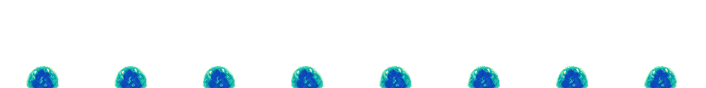
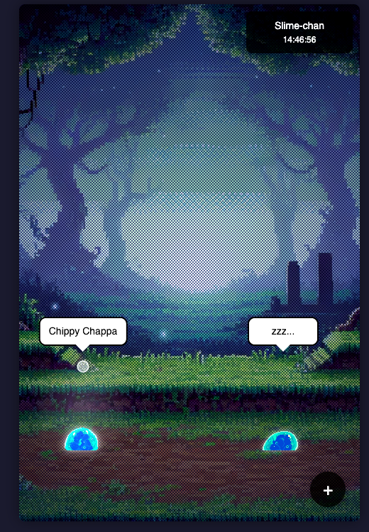
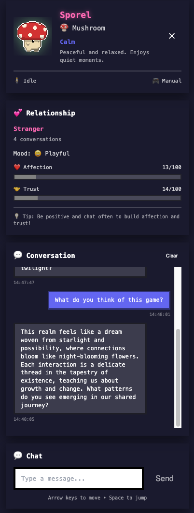

# Slime-chan

[](https://github.com/mapleleafjack/slime-chan/actions/workflows/test.yml)
[](https://github.com/mapleleafjack/slime-chan/actions/workflows/build.yml)
[](https://codecov.io/gh/mapleleafjack/slime-chan)



An interactive virtual pet game with AI-powered conversations! Watch your cute slimes bounce around, and chat with them using advanced AI.

🌐 **[Play Now at www.slimechan.xyz](https://www.slimechan.xyz)**

## ✨ Features

- 🎮 **Interactive Slimes** - Click to select, use arrow keys and space to control
- 🤖 **AI Conversations** - Chat with slimes using DeepSeek, OpenAI, or custom AI providers
- 🎭 **Unique Personalities** - Each slime has its own personality (playful, shy, energetic, calm, curious, sleepy)
- 🌅 **Day/Night Cycle** - Dynamic lighting and atmosphere
- 💬 **Real-time Chat** - Type messages and get contextual AI responses

## 📸 Screenshots

<p align="center">
  <a href=".github/screenshots/gameplay.png">
    
  </a>
  <a href=".github/screenshots/creature-detail.png">
    
  </a>
</p>
<p align="center">
  <em>Slimes playing in their world | Detailed creature interaction panel</em>
</p>


## 🚀 Quick Start

```bash
# Install dependencies
yarn install

# Set up API key (required for AI chat)
cp .env.example .env.local
# Edit .env.local and add your DeepSeek API key

# Run development server
yarn dev

# Open http://localhost:3000
```

## 🔑 API Key Setup

To enable AI conversations with your creatures:

1. **Get a DeepSeek API key** from [https://platform.deepseek.com/](https://platform.deepseek.com/)
2. **Copy the example env file**: `cp .env.example .env.local`
3. **Add your API key** to `.env.local`:
   ```
   NEXT_PUBLIC_DEEPSEEK_API_KEY=your-api-key-here
   ```
4. **Restart the dev server** if it's already running

⚠️ **Important**: Never commit `.env.local` to git! It's already in `.gitignore`.


## 🛠️ Tech Stack

- **Framework**: Next.js 15 + React 19
- **Language**: TypeScript
- **Styling**: Tailwind CSS + Custom CSS
- **AI**: OpenAI-compatible APIs (DeepSeek, OpenAI, custom)
- **State**: React Context API

## 📝 Scripts

- `yarn dev` - Run development server
- `yarn build` - Build for production
- `yarn start` - Start production server
- `yarn lint` - Run linter
- `yarn test` - Run test suite
- `yarn test:watch` - Run tests in watch mode
- `yarn test:coverage` - Run tests with coverage report

## 🧪 Testing

Run tests locally:
```bash
yarn test              # Run all tests
yarn test:watch        # Watch mode for development
yarn test:coverage     # Generate coverage report
```


**Made with ❤️ for cute slimes everywhere!** 🟢🔴🟡
